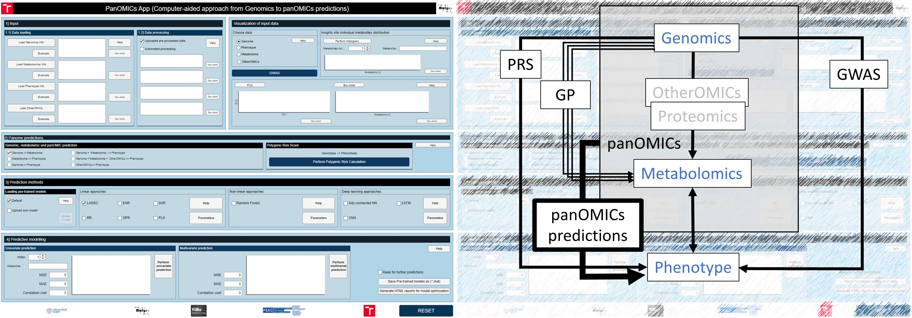

# PANOMICs App

Illustrated manual is available here: [The manual PDF](PANOMICsApp_manual.pdf)

## Introduction

Advancements in sequencing technologies have propelled molecular biology research into the post-genomic era. Research now focuses on understanding functional relationships between individual genes and their impact on the final phenotype. 

The PANOMICs app, implemented using Matlab2023b App Designer, provides a user-friendly tool for uploading genomic and metabolomic data, visualizing it, and performing prediction analysis using various methods, including linear, non-linear, and deep learning techniques.

## Installation

To install the PANOMICs App, follow the instructions below depending on your MATLAB setup.

### Option 1: MATLAB installed

If MATLAB is already installed on your computer, the application can be executed directly:

1. Navigate to:
   `PanOMICs_app/for_testing/`
2. Run:
   `PANOMICs.exe`

---

### Option 2: Standalone version (no MATLAB required)

If MATLAB is not installed or you do not have a valid MATLAB license, you can use the standalone version of the application.

1. Navigate to:
   `PanOMICs_app/for_redistribution/`
2. Run the installer:
   `MyAppInstaller_web.exe`
3. After installation, download the example input data from:
   `PANOMICSApp/for_testing/input_example`
4. Place the example data folder in the same directory as the installed application executable.

#### Web version

A web-based version of the PANOMICS App is also available for demonstration purposes and lightweight analyses:

[https://apps.pph.univie.ac.at/webapps/home/](https://apps.pph.univie.ac.at/webapps/home/)

The web and desktop versions share a consistent user interface and do not require a MATLAB license. Users can upload datasets, perform preprocessing, visualize data, and run prediction analyses directly through the browser.

The web version provides the full core functionality of the application; however, performance may be limited by server-side computational resources, particularly for large datasets or computationally intensive analyses. For such cases, the standalone desktop version is recommended.

#### Important

To run the standalone application, it is required to download and install **MATLAB Runtime R2023b (23.2)**.

The MATLAB Runtime is freely available and does **not** require any MATLAB license. It enables running the full desktop application independently of MATLAB.

[Download MATLAB Runtime R2023b (23.2) here](https://www.mathworks.com/products/compiler/matlab-runtime.html)

Please install the MATLAB Runtime before launching the application.

## 1. Input

The first section of the app is designed for uploading data. The app expects genomic data in the form of SNP matrices, where '0' indicates an undetected SNP and '1' indicates a detected SNP. Users can also upload metabolomic data related to individual samples associated with the SNP data. Additionally, phenotypic data can be uploaded for calculating Polygenic Risk Scores (PRS) and panOMICs predictions.

- **Data processing:**  
  Users can upload genomic datasets in SNP matrix format, optionally supplemented with metabolomic and phenotypic data. Pre-processed datasets can be analyzed directly, while raw data can be processed using an automated preprocessing pipeline. This includes imputation of missing values (replaced with zeros for genomic and phenotypic data), substitution of missing metabolomic values with half of the minimum detected value, and log10 transformation of metabolite intensities. 

### Tested Data

- **Arabidopsis thaliana (Ath) datasets:**  
  Includes 37 metabolites from 241 Arabidopsis ecotypes under two temperature conditions (6°C and 16°C). The core genotype data comprises 16,544 SNPs.

- **Barley datasets:**  
  Includes genotype matrices for 1,363 lines from the wild barley NAM population HEB-25, genotyped with a 50k Illumina SNP Array. The dataset includes 33,005 SNPs after quality control.

- **Mice Datasets:**  
  Focused on obesity-related traits, this dataset includes genomic and phenotypic data analyzed using Bayesian Generalized Linear Regression.

- **Human Datasets:**  
  Derived from Kaggle's "SNP dataset for GWAS", focusing on SNPs crucial for genome-wide association studies.

## Visualization

The 'Visualization' section enhances the understanding of individual input samples. Genomic information can be visualized using Principal Component Analysis (PCA), allowing users to observe the distribution of individual SNPs or metabolites. The app also includes GWAS calculations for genetic information, and for metabolite data, users can view the distribution of metabolite concentrations using histogram plots.

- **PCA Visualization:**  
  Use the `mapcaplot` function to create 2-D scatter plots of principal components.

- **GWAS Button:**  
  Prompts the user to add SNP information for correct rendering in the Manhattan plot.

## 2. Panome prediction section 

The "Prediction Approaches" section offers users a range of options for making predictions, applicable to genomic predictions, metabolome predictions, OMICs predictions, and polygenic risk score (PRS) calculations.

### Polygenic Risk Score (PRS)

The PRS feature calculates an aggregate measure of genetic risk based on multiple SNPs associated with a particular phenotype. It provides a CSV file with the PRS results, which can be further analyzed or visualized.

## 3. Prediction methods section

The core components of the app are the 'Prediction Methods' sections. Users can select their desired predictions and specify the methods to be used. The app offers nine different prediction methods, categorized into linear, non-linear, and deep learning approaches.

### Linear Approaches

- **LASSO (Least Absolute Shrinkage and Selection Operator) Regression**  
- **RR (Ridge Regression)**  
- **ENR (Elastic Net Regularization)**  
- **GPR (Gaussian Process Regression)**  
- **SVR (Support Vector Machine Regression)**  
- **PLS (Partial Least-Squares) Regression**  

### Non-Linear Approaches

- **RF (Random Forest)**  

### Deep Learning Approaches

- **LSTM (Long Short-Term Memory)**  
- **CNN (Convolutional Neural Network)**  

## 4. Outputs (Results)

The results are divided into two parts, relying on genomics/metabolomics/OMICs prediction analysis. The prediction analysis is evaluated using mean square error (MSE), mean absolute error (MAE), and correlation coefficient (cc). Additionally, the software allows for visualizing a box plot of predicted and original values.

### Univariate Prediction

Focuses on single metabolites. Users can select the metabolite using the slider button and wait for the prediction analysis results.

### Multivariate Prediction

Includes all metabolites. The usage is analogous to univariate prediction.

Results can be saved in .mat format within this section and later reloaded in the Input section for further analysis or integration with new datasets. To support model selection and benchmarking, the application also includes an option to generate HTML reports, enabling systematic comparison of prediction performance across all implemented methods.

At the end, the user can either switch to another method in the "Prediction Methods" section and run a new prediction or use the RESET button to restore the application to its default settings.

## Literature

1. Weiszmann, Jakob, et al. "Metabolome plasticity in 241 Arabidopsis thaliana accessions reveals evolutionary cold adaptation processes." Plant physiology 193.2 (2023): 980-1000.
2. Gemmer, M.R., et al. "Can metabolic prediction be an alternative to genomic prediction in barley?." PLoS One, 15(6), p.e0234052 (2020).
3. Villar‐Hernández, B.D.J., et al. "A Bayesian optimization R package for multitrait parental selection." The Plant Genome, p.e20433 (2024).
4. Bojer, C.S., and Meldgaard, J.P. "Kaggle forecasting competitions: An overlooked learning opportunity." International Journal of Forecasting, 37(2), pp.587-603 (2021).

## The predecessor of this app, which was titled the CaGe app, was funded:
Supported by Ministry of Health, Czech Republic - conceptual development of research organization (FNOs/2024). 
This article has been produced with the financial support of the European Union under the LERCO project number CZ.10.03.01/00/22_003/0000003 via the Operational Programme Just Transition.

