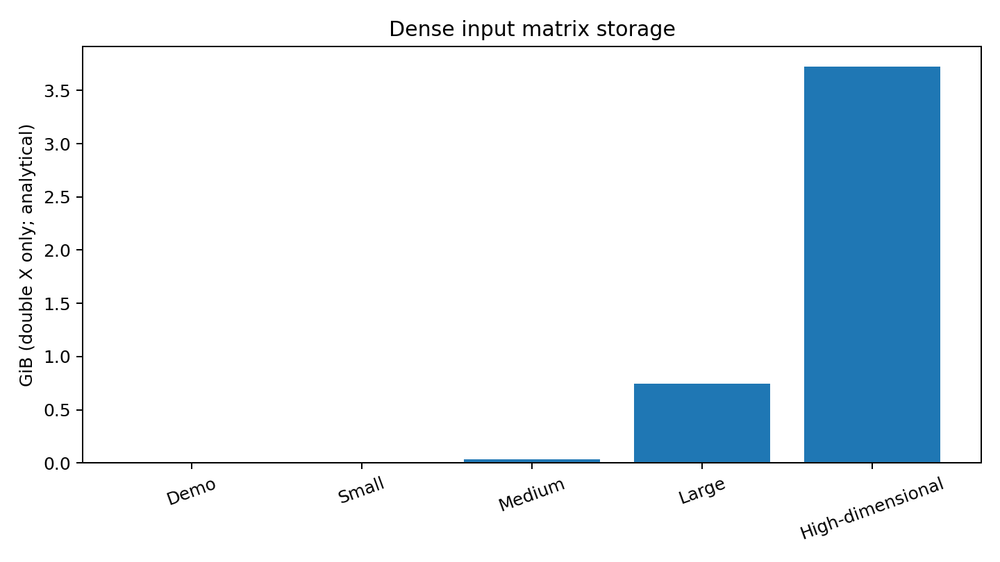
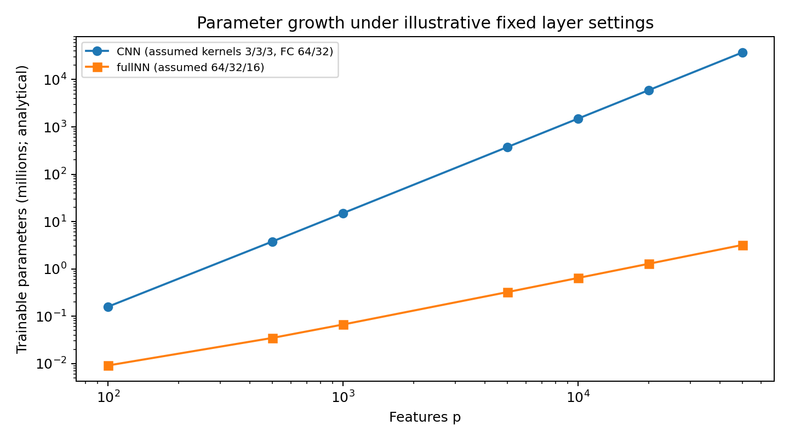
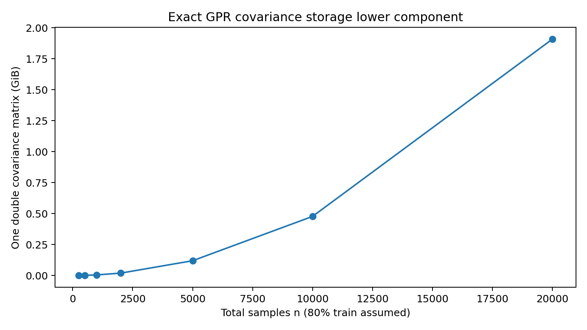

# PANOMICs — Unified Theoretical Complexity and RAM Scenario Report

**Scope:** All ten supplied MATLAB implementations were analyzed: LASSO, RR-labelled `lasso`, ENR, GPR, SVR, PLS, RF, LSTM, CNN, and fullNN. ENR is now source-verified; its actual alpha and cross-validation values remain application-configured and were not provided.

> **Evidence classification:** All tables and charts here are analytical calculations or illustrative proxies. No wall-clock runtime, CPU utilization, peak RAM, web-server quota, or maximum supported dataset was measured. This document is **not an empirical benchmark** and does not fully satisfy a request for measured desktop/web performance.

## 1. Notation and implementation inventory

| Model | Actual fitting path | Validation/evaluation | Interpretation overhead |
|---|---|---|---|
| LASSO | `lasso`, `Alpha=app.LASSO_alfa` | 70:30 holdout; inner `CV`; univariate fits twice | Mean-baseline linear contributions |
| RR-labelled | `lasso`, `Alpha=app.RR_alfa` | 70:30 holdout; inner `CV` | Mean-baseline linear contributions |
| ENR | `lasso`, `Alpha=app.ENR_alfa` | 70:30 holdout; inner `CV=app.ENR_cv` | Mean-baseline linear contributions |
| SVR | `fitrsvm` | Five manual folds, boundary overlap | Permutation + SHAP |
| RF | `TreeBagger`, OOB | OOB prediction | Permutation + SHAP on all X |
| PLS | `plsregress` | Five manual folds, boundary overlap | Permutation + SHAP |
| GPR | `fitrgp` | Five manual folds, boundary overlap | Permutation + SHAP |
| CNN | 3×`convolution1dLayer`, Adam CPU | 80:20 contiguous split | Permutation + SHAP |
| LSTM | `lstmLayer`, Adam CPU | 80:20 contiguous split | Permutation + SHAP |
| fullNN | 3×fully connected ReLU, Adam CPU | 80:20 contiguous split | Permutation + SHAP |

Definitions: `n` samples, `p` features, `q` response columns, `K` CV folds, `L` regularization-path length, `I` effective solver iterations, `a` PLS components, `T` trees, `m` split candidates, `E` epochs, `s` sequence length, `b` mini-batch size, `h` LSTM units, `h1,h2,h3` fullNN widths.

## 2. Time-complexity models (conditional asymptotic/proxy relations)

| Model | Training-work proxy | Qualifications |
|---|---|---|
| LASSO | `~2*(K+1)*L*I*(0.7n)*p` (fresh univariate) | Duplicate `lasso` call; coordinate-descent-style proxy; solver optimizations not resolved |
| RR-labelled | `~(K+1)*L*I*(0.7n)*p` | Positive Alpha in MATLAB `lasso` is not pure ridge |
| ENR | `~(K+1)*L*I*(0.7n)*p` | Source-verified one `lasso` call per fresh fit; actual alpha/CV and solver iteration counts unspecified |
| SVR | Solver-dependent; kernel approaches can involve `O(n_tr^2)` storage and superlinear optimization | MATLAB default `fitrsvm` settings/solver must be logged; avoid a universal `O(n^3)` claim |
| RF | `~O(T*m*n*log²n)` illustrative split-search bound | Balanced-tree/sorting assumptions; OOB + attribution extra |
| PLS | `~O(5*I*n_tr*p*q*a)` illustrative iterative PLS proxy | MATLAB algorithm and default component count matter |
| GPR | `~O(5*(n_tr^3+n_tr²*p))` exact dense proxy | Default fitting method may use approximations; prediction uncertainty adds work |
| LSTM | `~O(E*n_tr*s*(4*h*(p+h)+h*d+d))` | Requires valid sequence layout; CPU Adam |
| CNN | `~O(E*n_tr*s*((k1+2k2+2k3)*p²+p*d1+d1*d2))` | Channel widths proportional to p; sequence layout unverified |
| fullNN | `~O(E*0.8*n*(p*h1+h1*h2+h2*h3+h3))` | CPU Adam; actual epochs sourced from CNN-named property |

**End-to-end accounting:** `T_total = T_preprocessing + T_fit + T_predict + T_permutation + T_SHAP + T_visualization`. The helper implementations are unavailable, so no defensible numeric end-to-end time estimate exists. Neither FLOP proxies nor Big-O can be converted into seconds without calibrated hardware and MATLAB measurements.

## 3. Illustrative RAM scenarios

All examples assume a dense **double-precision** `n×p` input matrix. The **data+copy+SHAP proxy** includes `X` + one complete train/test copy + one `0.2n×p` attribution matrix; it excludes model training workspaces, helper intermediates, MATLAB overhead, other omics matrices, and deployment services. CNN and fullNN parameter examples use **hypothetical** kernel widths `(3,3,3)` and dense widths `CNN=(64,32)`, `fullNN=(64,32,16)`; their parameter+gradient+Adam-state column assumes four float32 arrays (16 bytes/parameter), not measured memory.

| Scenario | n | p | Input X (GiB) | Data+copies+SHAP proxy (GiB) | CNN params (millions) | CNN 4-array model proxy (GiB) | fullNN 4-array proxy (GiB) |
|---|---:|---:|---:|---:|---:|---:|---:|
| Demo | 239 | 249 | 0.000 | 0.001 | 0.95 | 0.014 | 0.0003 |
| Small | 500 | 1,000 | 0.004 | 0.008 | 15.07 | 0.225 | 0.0010 |
| Medium | 1,000 | 5,000 | 0.037 | 0.082 | 375.34 | 5.593 | 0.0048 |
| Large | 5,000 | 20,000 | 0.745 | 1.639 | 6001.36 | 89.427 | 0.0191 |
| High-dimensional | 10,000 | 50,000 | 3.725 | 8.196 | 37503.40 | 558.844 | 0.0477 |

**How to read the table:** Values are storage arithmetic, not actual peak process RAM. A small `X` does not guarantee a model will fit: GPR kernel matrices scale as `n_tr²`, kernel SVR may require large solver buffers, CNN parameters grow as `p²`, and SHAP can multiply prediction work and allocate large temporary arrays. For example, the high-dimensional CNN parameter proxy alone can exceed common consumer RAM tiers even though the input matrix is comparatively modest.

### Consumer RAM tiers (8, 16, 32, 64 GB)

Installed RAM is **not fully available** to MATLAB. For planning only, the next table applies a deliberately illustrative **50% of installed RAM** working-budget rule (4/8/16/32 GB respectively). This is not a validated safety margin and not a claim of dataset support. Note: hardware is marketed in decimal GB; model storage tables above use binary GiB.

| Installed RAM | Illustrative budget | Interpretation |
|---:|---:|---|
| 8 GB | 4 GB | Small datasets may be feasible; quadratic kernel/parameter structures can dominate |
| 16 GB | 8 GB | More headroom, but no guaranteed GPR/CNN/SHAP capacity |
| 32 GB | 16 GB | Larger analytical working sets possible; still requires empirical peak checks |
| 64 GB | 32 GB | More headroom; algorithmic scaling and server quotas remain limiting |

### Memory scaling equations

- Dense input: `M_X = 8np` bytes for `double`.
- Exact GPR training covariance: at least `8*n_tr²` bytes for one double matrix, excluding factorizations and model copies.
- Kernel SVR: a dense `n_tr×n_tr` kernel-like workspace, **if allocated**, is `8*n_tr²` bytes; the actual MATLAB solver may not materialize this matrix.
- RF: tree nodes/leaf data and training copies depend on `T`, depth, and tree implementation; no universal bytes/tree constant.
- CNN: `P_CNN = (k1+2k2+2k3)p²+(4+d1)p+d1+d1*d2+2d2+1`.
- LSTM: `P_LSTM = 4h(p+h+1)+(h+1)d+(d+1)` for the supplied LSTM→FC(d)→FC(1) stack (dropout has no parameters).
- fullNN: `P_fullNN = (p+1)h1+(h1+1)h2+(h2+1)h3+(h3+1)`.
- Neural training memory includes weights, gradients, optimizer moments, saved activations, data copies, and runtime buffers.

## 4. Figures (model-based, not measured)

The plots deliberately avoid displaying **seconds** or measured **peak RAM** because none were collected.

## 5. Code-level scientific limitations that affect fair benchmarking

1. **ENR cached-model leakage and response shape:** ENR creates a new random holdout when reusing cached coefficients, which can invalidate held-out evaluation. Its multivariate-labelled path uses linear response indexing rather than true multi-response ENR. The actual `app.ENR_alfa` must be checked (`0<Alpha<1` for elastic net).
2. **CV leakage:** GPR, SVR and PLS manually construct five test blocks with overlapping endpoints and some train/test overlap. Replace with `cvpartition(n,'KFold',5)` and derive `training`/`test` indices from the same partition.
3. **GPR/SVR/PLS MeanSHAP:** `MeanSHAPAll` is initialized but not populated, yielding misleading zero summaries.
3. **Model identity:** RR-labelled routine calls `lasso` with positive mixing `Alpha`, not mathematically exact ridge.
4. **LASSO duplicate fit:** Fresh univariate code calls `lasso` twice with the same options.
5. **Multi-response definitions:** GPR, SVR, RF, LSTM, CNN and fullNN reduce `Y` to `mean(Y,2)`; PLS genuinely fits multi-output `beta`, but its interpretation averages output predictions.
6. **CNN/LSTM layout:** Transposed numeric matrices passed to `sequenceInputLayer` require explicit verification of observation and time dimensions.
7. **fullNN settings:** Uses CNN-named epoch and gradient-threshold app fields; verify intended control wiring.
8. **Data order:** Neural methods use contiguous first-80%-train split and `Shuffle=never`; document whether observations are exchangeable or ordered.
9. **Cache effects:** Some methods reuse trained models and skip interpretability; compare cold and warm paths separately.
10. **Attribution helpers:** Exact call counts, background sample sizes, permutation repeats, and temporary allocations are unknown.
11. **Desktop vs web:** Code cannot reveal hardware, server concurrency, queueing, quotas, network latency, or peak RAM.

## 6. Empirical benchmark protocol required for the editor

Run each algorithm in **both** desktop and deployed web settings using documented dataset sizes, fixed random seeds/splits, fixed hyperparameters, and at least 3–5 repetitions. Measure cold-start and warm-start separately. Record `fit`, `predict`, `permutation`, `SHAP`, `total`, and `peak process RSS` (or a documented equivalent), plus failures/timeouts. Log MATLAB release, CPU, logical cores, OS, installed/available RAM, application version, and web host/container limits. Ensure identical response definitions and splits before comparing predictive performance. For large datasets, use bounded SHAP background/evaluation subsets and state them.

Suggested CSV columns: `timestamp,app_version,environment,matlab_release,os,cpu,ram_gb,server_quota_gb,algorithm,n,p,q,fold,seed,hyperparameters,mode,fit_s,predict_s,permutation_s,shap_s,total_s,peak_rss_gb,status,error`.

## 7. Manuscript-ready text

> We assessed the theoretical computational scaling of the ten algorithm categories implemented in PANOMICs, based on inspection of the available MATLAB routines. Analytical models were derived for fitting, prediction, and model-interpretability components, and illustrative storage calculations were evaluated across representative dataset dimensions and consumer RAM configurations. These calculations highlight potentially quadratic memory or parameter growth for covariance-based GPR and the current CNN architecture, respectively, while dense linear-model input storage grows with the product of sample and feature counts. The analytical results do not represent empirical desktop or web execution times, measured peak memory, or validated capacity limits. Direct performance measurements across both deployment environments remain necessary to establish practical scalability.

## 8. Source and completeness

This report consolidates all ten source-based analyses: `LASSO_COMPLEXITY.md`, `RR_COMPLEXITY.md`, `ENR_COMPLEXITY.md`, `GPR_COMPLEXITY.md`, `SVR_COMPLEXITY.md`, `PLS_COMPLEXITY.md`, `RF_COMPLEXITY.md`, `LSTM_COMPLEXITY.md`, `CNN_COMPLEXITY.md`, and `fullNN_COMPLEXITY.md`. Helper implementations for permutation importance and SHAP, and runtime configuration values, have not been supplied; corresponding overhead estimates remain conditional.
